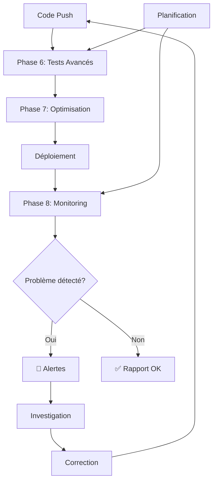

# 🚀 Phases Avancées du Projet HTML to PNG Converter

Ce document décrit les phases avancées mises en place pour optimiser, tester et monitorer votre application de manière continue.

## 📋 Vue d'ensemble des Phases Avancées

### Phase 6: 🧪 Tests Avancés et Monitoring
**Fichier**: `.github/workflows/advanced-testing.yml`
**Déclenchement**: Push, Pull Request, Planifié (quotidien), Manuel

#### 🔗 Tests d'Intégration E2E
**Objectif**: Vérifier le fonctionnement complet de l'application

**Tests réalisés**:
- ✅ Test de chargement de la page principale
- ✅ Vérification des éléments critiques (boutons, inputs)
- ✅ Test de chargement des scripts et styles
- ✅ Validation de la structure HTML complète

#### ⚡ Tests de Performance
**Objectif**: Mesurer et optimiser les performances

**Analyses effectuées**:
- 📊 Audit Lighthouse complet
- 📏 Vérification de la taille des fichiers
- 📈 Métriques de performance (scores)
- ⏱️ Temps de chargement et réactivité

#### 🌐 Tests de Compatibilité Navigateur
**Objectif**: Assurer la compatibilité multi-navigateurs

**Vérifications**:
- 🔍 Validation HTML5 moderne
- 📱 Test du design responsive
- 🎯 Vérification des media queries
- 📐 Contrôle du viewport

#### ♿ Audit d'Accessibilité
**Objectif**: Garantir l'accessibilité pour tous les utilisateurs

**Contrôles**:
- 🏷️ Vérification des labels de formulaire
- 🎨 Test des attributs ARIA
- 🌈 Contrôle des couleurs et contrastes
- 📝 Validation de la structure sémantique

### Phase 7: 📦 Optimisation des Assets
**Fichier**: `.github/workflows/optimization.yml`
**Déclenchement**: Push sur fichiers assets, Manuel

#### 🗜️ Minification des Assets
**Objectif**: Réduire la taille des fichiers pour améliorer les performances

**Optimisations appliquées**:
- 📄 **JavaScript**: Minification avec Terser
  - Compression du code
  - Suppression des commentaires
  - Optimisation des variables
  
- 🎨 **CSS**: Minification avec CSSO
  - Suppression des espaces inutiles
  - Optimisation des sélecteurs
  - Fusion des règles similaires
  
- 📝 **HTML**: Minification avec html-minifier-terser
  - Suppression des espaces et commentaires
  - Optimisation des balises
  - Minification du CSS/JS inline

#### 🖼️ Optimisation des Images
**Objectif**: Réduire la taille des images sans perte de qualité

**Outils utilisés**:
- 📸 **PNG**: OptipNG (optimisation sans perte)
- 📷 **JPEG**: JPEGOptim (compression intelligente)
- 📊 Rapport de réduction de taille

#### 🗄️ Configuration du Cache
**Objectif**: Optimiser la mise en cache des assets

**Configurations**:
- ⏰ En-têtes d'expiration appropriés
- 🗜️ Compression gzip activée
- 📋 Fichier .htaccess pour Apache
- 🚀 Assets prêts pour la production

### Phase 8: 📊 Monitoring et Alertes Avancées
**Fichier**: `.github/workflows/monitoring.yml`
**Déclenchement**: Planifié (quotidien/hebdomadaire), Manuel

#### 🏥 Vérification de Santé
**Objectif**: Surveiller la disponibilité et la santé du site

**Contrôles effectués**:
- 🌐 Test de disponibilité du site
- ⏱️ Mesure du temps de réponse
- 🔍 Vérification du contenu principal
- 🎯 Test des fonctionnalités critiques

#### ⚡ Monitoring des Performances
**Objectif**: Surveiller les performances en continu

**Métriques surveillées**:
- 📊 **Scores Lighthouse**:
  - Performance (seuil: 80/100)
  - Accessibilité (seuil: 90/100)
  - Bonnes pratiques
  - SEO
  
- 🎯 **Core Web Vitals**:
  - First Contentful Paint (FCP)
  - Largest Contentful Paint (LCP)
  - Cumulative Layout Shift (CLS)
  - First Input Delay (FID)

#### 🔒 Monitoring de Sécurité
**Objectif**: Détecter les vulnérabilités et problèmes de sécurité

**Audits de sécurité**:
- 🛡️ **En-têtes de sécurité**:
  - X-Frame-Options
  - X-Content-Type-Options
  - Referrer-Policy
  - Content-Security-Policy
  
- 🔍 **Scan du code**:
  - Détection des scripts dangereux
  - Recherche d'eval() et innerHTML
  - Vérification des secrets/clés API
  - Patterns de sécurité problématiques

#### ⏰ Monitoring de Disponibilité
**Objectif**: Surveiller l'uptime et la réactivité

**Tests de disponibilité**:
- 📈 Tests multiples sur période
- 📊 Calcul du pourcentage d'uptime
- ⏱️ Temps de réponse moyen
- 🚨 Alertes automatiques si problème

#### 🚨 Système d'Alertes
**Objectif**: Notification immédiate en cas de problème

**Types d'alertes**:
- 🔴 **Critiques**: Site hors ligne
- ⚠️ **Performance**: Temps de réponse élevé
- 🔒 **Sécurité**: Vulnérabilités détectées
- 📊 **Qualité**: Scores en dessous des seuils

## 🔄 Workflow Global des Phases Avancées



## 📊 Métriques et KPIs

### 🎯 Objectifs de Performance
- **Lighthouse Performance**: > 80/100
- **Lighthouse Accessibilité**: > 90/100
- **Temps de réponse**: < 2000ms
- **Uptime**: > 99%
- **Taille des assets**: Optimisée (-30% minimum)

### 📈 Indicateurs de Qualité
- **Tests d'intégration**: 100% de réussite
- **Compatibilité navigateur**: Validée
- **Accessibilité**: Conforme WCAG
- **Sécurité**: Aucune vulnérabilité critique

## 🛠️ Configuration et Personnalisation

### ⚙️ Variables d'Environnement
```yaml
# Dans les workflows GitHub Actions
SITE_URL: "https://liilvame.github.io/HTMLtoPNG/"
PERFORMANCE_THRESHOLD: 80
ACCESSIBILITY_THRESHOLD: 90
RESPONSE_TIME_THRESHOLD: 2000
```

### 🔧 Personnalisation des Seuils
Vous pouvez modifier les seuils d'alerte dans les fichiers de workflow :
- Performance Lighthouse
- Temps de réponse
- Taille des fichiers
- Scores d'accessibilité

### 📅 Planification des Exécutions
- **Tests avancés**: Quotidien à 2h
- **Monitoring**: Quotidien à 6h, Hebdomadaire le dimanche
- **Optimisation**: Sur modification des assets

## 📋 Rapports et Artifacts

### 📊 Rapports Générés
1. **Rapport Lighthouse**: Métriques de performance détaillées
2. **Rapport d'optimisation**: Gains de taille et optimisations
3. **Rapport de monitoring**: État global du système
4. **Log d'incidents**: Historique des problèmes

### 📤 Artifacts Disponibles
- `lighthouse-report`: Rapport Lighthouse JSON
- `optimized-assets`: Assets optimisés
- `monitoring-report`: Rapport de monitoring
- `incident-log`: Logs d'incidents (si applicable)

### 📈 Rétention des Données
- **Rapports quotidiens**: 30 jours
- **Assets optimisés**: 90 jours
- **Logs d'incidents**: 365 jours

## 🚀 Prochaines Étapes

### 🔮 Améliorations Futures
1. **Tests visuels**: Comparaison de screenshots
2. **Tests de charge**: Simulation de trafic élevé
3. **Monitoring géographique**: Tests depuis différentes régions
4. **Intégration Slack/Discord**: Notifications en temps réel
5. **Dashboard de monitoring**: Interface web pour les métriques

### 🎯 Objectifs à Long Terme
- **Performance**: Score Lighthouse > 95
- **Accessibilité**: Certification WCAG AAA
- **Sécurité**: Audit de sécurité automatisé
- **Monitoring**: Surveillance 24/7 avec alertes instantanées

## 🆘 Support et Dépannage

### 🔍 Diagnostic des Problèmes
1. **Échec des tests**: Consulter les logs dans l'onglet "Actions"
2. **Performance dégradée**: Vérifier le rapport Lighthouse
3. **Site inaccessible**: Consulter les logs d'incidents
4. **Optimisation échouée**: Vérifier la syntaxe des fichiers

### 📞 Contacts et Ressources
- **Documentation GitHub Actions**: [docs.github.com/actions](https://docs.github.com/actions)
- **Lighthouse**: [developers.google.com/web/tools/lighthouse](https://developers.google.com/web/tools/lighthouse)
- **Web Vitals**: [web.dev/vitals](https://web.dev/vitals)

---

**Dernière mise à jour**: $(date)
**Version des phases avancées**: 1.0
**Statut**: ✅ Actif et opérationnel

*Toutes les phases avancées sont maintenant configurées et prêtes à fonctionner automatiquement.*