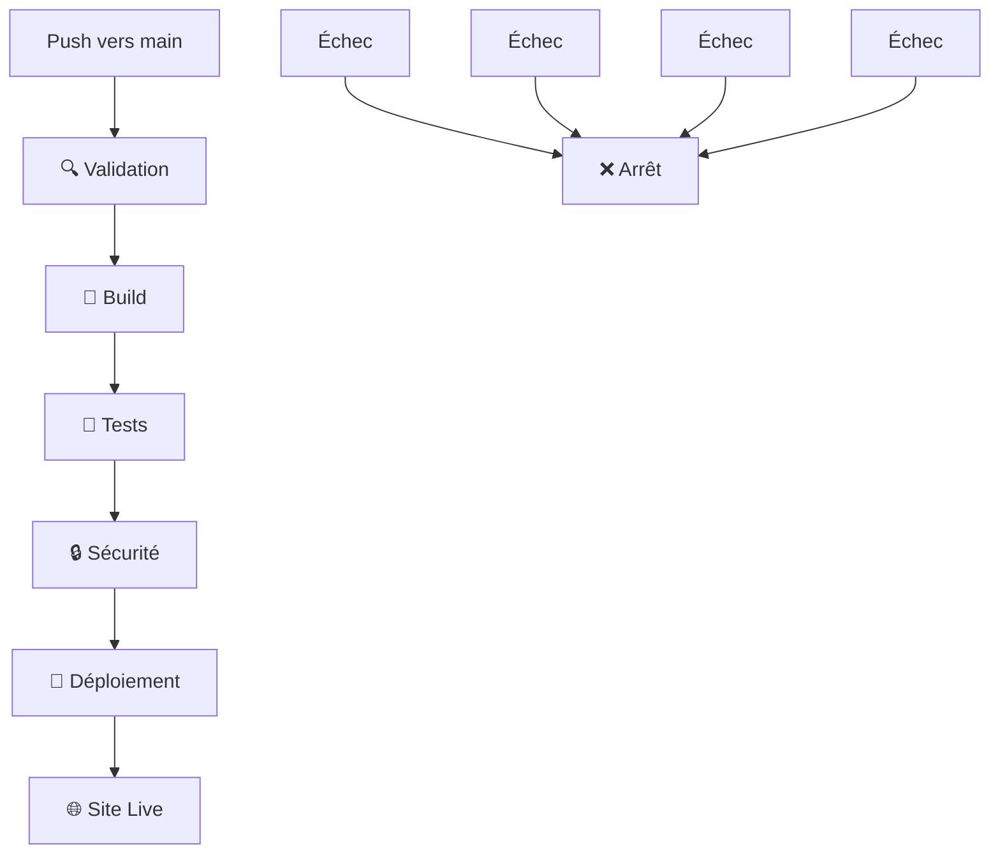

# 🚀 Phases de Déploiement Automatique GitHub Pages

Ce document décrit les 5 phases du processus de déploiement automatique mis en place pour votre application HTML to PNG Converter.

## 📋 Vue d'ensemble des phases

### Phase 1: 🔍 Validation du Code
**Objectif**: Vérifier la structure et la syntaxe des fichiers

**Actions réalisées**:
- ✅ Validation de la structure HTML
- ✅ Vérification de la syntaxe JavaScript
- ✅ Validation des fichiers CSS
- ✅ Contrôle de l'existence des fichiers requis

**Critères de réussite**:
- `index.html` doit exister
- Tous les fichiers HTML doivent avoir une structure valide
- Aucune erreur de syntaxe JavaScript détectée

### Phase 2: 🔨 Build et Optimisation
**Objectif**: Préparer et optimiser les assets pour la production

**Actions réalisées**:
- 📦 Création d'un répertoire de build optimisé
- 📋 Copie des fichiers essentiels
- ⚙️ Configuration de GitHub Pages
- 📤 Upload de l'artifact de build

**Optimisations appliquées**:
- Structure de fichiers organisée
- Exclusion des fichiers non nécessaires
- Préparation pour le déploiement statique

### Phase 3: 🧪 Tests Fonctionnels
**Objectif**: Vérifier le bon fonctionnement de l'application

**Tests exécutés**:
1. **Test d'existence des fichiers requis**:
   - `index.html`
   - `script.js`
   - `styles.css`
   - `social-share.js`

2. **Test de structure HTML**:
   - Présence des balises `<html>` et `</html>`
   - Structure HTML valide

3. **Test de syntaxe JavaScript**:
   - Vérification des mots-clés JavaScript
   - Détection des erreurs de syntaxe basiques

### Phase 4: 🔒 Audit de Sécurité
**Objectif**: Identifier les vulnérabilités potentielles

**Contrôles de sécurité**:
- 🔍 Détection de données sensibles (mots de passe, clés, tokens)
- 🌐 Vérification des scripts externes
- 📋 Audit des sources non sécurisées

**Alertes de sécurité**:
- ⚠️ Avertissement si des données sensibles sont détectées
- ⚠️ Notification des scripts externes non sécurisés

### Phase 5: 🚀 Déploiement
**Objectif**: Déployer l'application sur GitHub Pages

**Conditions de déploiement**:
- ✅ Toutes les phases précédentes doivent réussir
- ✅ Push sur la branche `main` uniquement
- ✅ Pas de déploiement sur les Pull Requests

**Actions de déploiement**:
- 🌐 Déploiement sur GitHub Pages
- 📧 Notification de succès avec URL
- 📅 Horodatage du déploiement

## 🔄 Workflow de Déploiement

## 📊 Métriques et Monitoring

### Temps d'exécution estimé
- **Validation**: ~30 secondes
- **Build**: ~45 secondes
- **Tests**: ~1 minute
- **Sécurité**: ~30 secondes
- **Déploiement**: ~2 minutes

**Total**: ~4-5 minutes par déploiement

### Indicateurs de succès
- ✅ Toutes les phases passent
- 🌐 Site accessible via l'URL GitHub Pages
- 📈 Aucune régression détectée

## 🛠️ Maintenance et Amélioration

### Améliorations futures possibles
1. **Tests plus avancés**:
   - Tests d'intégration
   - Tests de performance
   - Tests de compatibilité navigateur

2. **Optimisations de build**:
   - Minification des assets
   - Compression des images
   - Optimisation du cache

3. **Monitoring avancé**:
   - Alertes en cas d'échec
   - Métriques de performance
   - Logs détaillés

## 🔧 Dépannage

### Problèmes courants

**Échec de validation**:
- Vérifier que `index.html` existe
- Contrôler la syntaxe des fichiers

**Échec de build**:
- Vérifier les permissions GitHub
- Contrôler la structure des fichiers

**Échec de déploiement**:
- Vérifier les paramètres GitHub Pages
- Contrôler les permissions du repository

### Support
Pour toute question ou problème, consultez :
- [Documentation GitHub Pages](https://docs.github.com/pages)
- [GitHub Actions Documentation](https://docs.github.com/actions)
- Logs des workflows dans l'onglet "Actions" du repository

---

**Dernière mise à jour**: $(date)
**Version du workflow**: 2.0
**Statut**: ✅ Actif et opérationnel